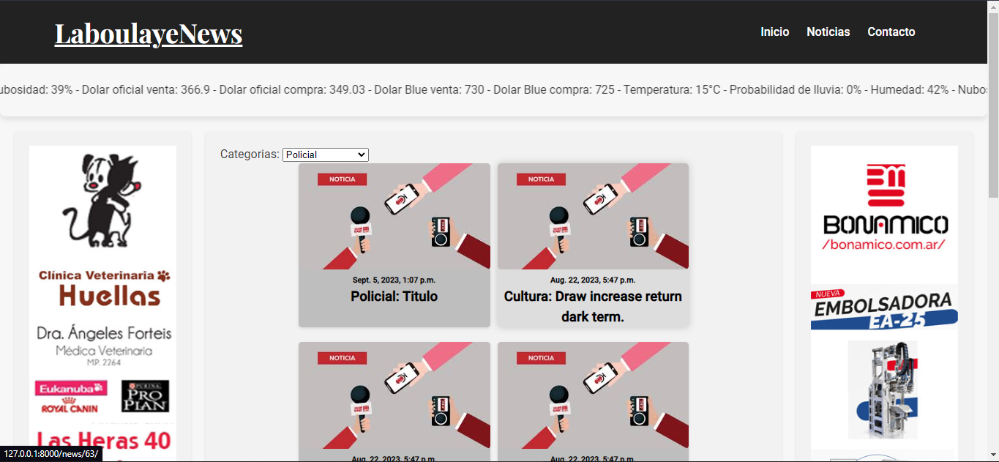
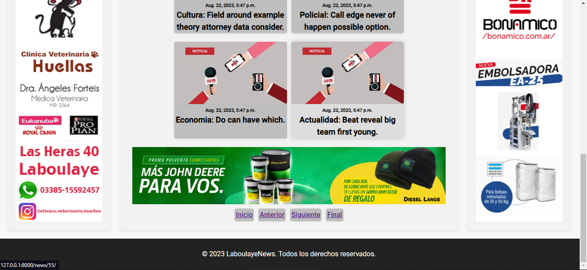
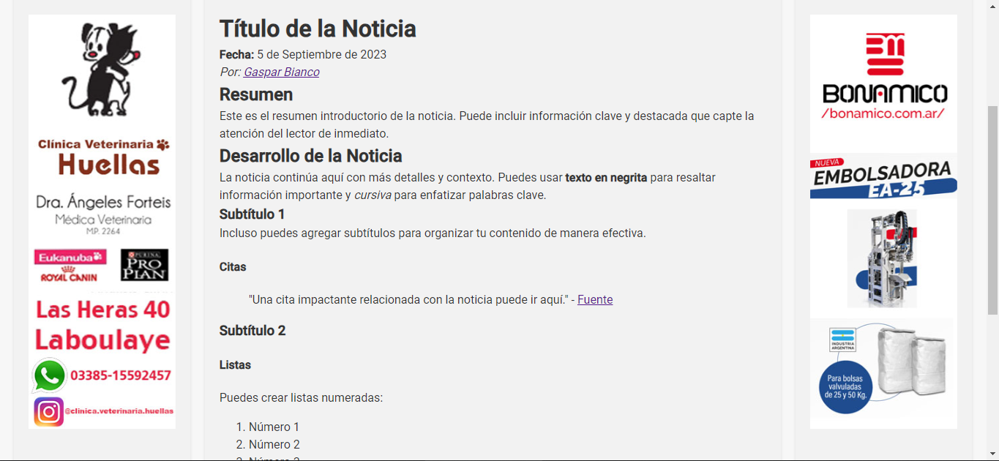

# Portal de Noticias Dinámico

Este es un proyecto de portal de noticias dinámico desarrollado con Django. El portal permite la gestión y visualización de noticias con contenido en formato Markdown. Todas las noticias y categorías se cargan dinámicamente desde una base de datos, la información en la barra de navegación se carga desde APIS de terceros.

## Capturas de Pantalla

A continuación, algunas capturas de pantalla del proyecto:

### Página de Inicio

### Detalle de Noticia

## Características

- **Gestión de Noticias:** Agregar, editar y eliminar noticias de manera sencilla desde el panel de administración.
- **Categorías:** Organiza tus noticias en categorías personalizadas.
- **Formato de Texto:** Utiliza Markdown para dar formato a tus noticias y hacerlas más atractivas.
- **Dinámico:** Todo el contenido se carga desde la base de datos, lo que facilita la actualización y expansión del sitio.
- **Panel de Administración de Django:** Utiliza el potente panel de administración de Django para gestionar tu portal.

## Instalación